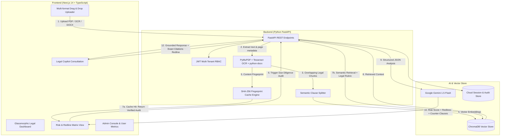

# LexiGuard AI ⚖️🛡️ | Enterprise Legal Contract Intelligence & Risk Auditor

[](https://lexi-guard-ai.vercel.app)
[](https://lexi-guard-api.vercel.app/docs)
[](https://www.python.org/)
[](https://fastapi.tiangolo.com/)
[](https://nextjs.org/)
[](https://www.trychroma.com/)
[](https://ai.google.dev/)
[](https://tailwindcss.com/)

**LexiGuard AI** is a production-grade LegalTech SaaS platform engineered for automated contract intelligence, legal due diligence, and risk redlining. Unlike generic LLM chat interfaces, LexiGuard AI executes structured, repeatable compliance audits across commercial agreements (NDAs, MSAs, SaaS agreements, Employment contracts, Vendor SLAs). 

The platform calculates an automated **Contract Risk Score (0–100)**, flags hazardous clauses (Unlimited Liability, Non-Compete Traps, Arbitrary Termination), detects missing protective provisions (Negative Pattern RAG), auto-drafts reciprocal counter-clauses, and powers an interactive **Legal Copilot** with pinpoint page-level citations.

---

## 🌐 Live Production Links & Instant Demo Access

| Resource | URL | Notes |
| :--- | :--- | :--- |
| **Production Web App** | [https://lexi-guard-ai.vercel.app](https://lexi-guard-ai.vercel.app) | Full-featured Next.js frontend |
| **Backend REST API** | [https://lexi-guard-api.vercel.app](https://lexi-guard-api.vercel.app) | FastAPI serverless deployment |
| **Interactive API Docs** | [https://lexi-guard-api.vercel.app/docs](https://lexi-guard-api.vercel.app/docs) | Swagger OpenAPI specification |

### 🔑 Instant Demo Credentials

You can test the live application immediately using the pre-configured accounts below, or register a new account on the [Sign Up page](https://lexi-guard-ai.vercel.app/register):

| Role | Email | Password | Access Level |
| :--- | :--- | :--- | :--- |
| **System Admin** | `admin@gmail.com` | `admin123` | Full access + Enterprise Admin Console & System Metrics |
| **Legal Analyst** | `nirasha@gmail.com` | `admin123` | Dedicated contract workspace, audit reports, isolated copilot |
| **Standard User** | `kasun@gmail.com` | `admin123` | Clean user sandbox |

---

## 🌟 Key Enterprise Capabilities

- ⚖️ **Automated Contract Risk Scoring (0–100):** Instantly calculates legal risk severity (`SAFE`, `LOW`, `MEDIUM`, `HIGH`, `CRITICAL`) using standardized legal audit rubrics.
- 🔒 **Deterministic SHA-256 Content Caching:** Guarantees 100% consistent audit scores across duplicate document uploads and multiple users.
- 🚨 **Clause Redline & Hazard Matrix:** Identifies predatory terms, provides plain-English risk explanations, and auto-drafts fair **AI Counter-Clauses** ready for copy-pasting into drafts.
- ⚠️ **Missing Clause Detection (Negative Pattern RAG):** Audits for omitted essential terms (e.g., Liability Caps, Mutual Termination, Governing Law, GDPR Breach Notification).
- 💬 **Interactive Legal Copilot:** Multi-turn legal assistant capable of drafting negotiation strategies, checking indemnification limits, and answering queries with exact page-level citations.
- 📑 **Strict Per-Document Chat Isolation:** Automatically segments chat conversations per contract to eliminate cross-document prompt hallucination.
- 📄 **Multi-Format Ingestion & OCR:** Supports native digital PDFs, scanned image PDFs via **Tesseract OCR**, and Microsoft Word documents (`.docx`).
- 👥 **Enterprise Multi-Tenancy & RBAC:** Secure JWT authentication with strict per-user document isolation and an administrative oversight console.
- 📚 **Built-in Sample Contracts Library:** 9 pre-loaded real-world legal agreements (Vendor MSAs, SaaS Contracts, Non-Disclosures, Employment Agreements) for zero-setup evaluation.
- 📋 **Executive Due Diligence Reports:** One-click export to Markdown (`.md`) and executive print-ready PDF reports.
- 🎨 **Futuristic Enterprise Glassmorphism UI:** Built with **Next.js 14**, **TypeScript**, **Tailwind CSS**, and **Lucide Icons** with full Dark/Light mode support.

---

## 🏗️ System Architecture & Legal RAG Pipeline



---

## 🛠️ Technology Stack

| Layer | Technology | Purpose |
| :--- | :--- | :--- |
| **Frontend** | **Next.js 14**, TypeScript, React 18 | App Router, Server/Client components, responsive layout |
| **Styling** | **Tailwind CSS**, Vanilla CSS, Lucide Icons | Responsive glassmorphism interface, dark/light themes |
| **Backend API** | **FastAPI** (Python 3.12), Pydantic v2, Uvicorn | High-performance asynchronous REST API |
| **Document Processing** | **PyMuPDF**, **Tesseract OCR**, **python-docx** | Digital PDFs, scanned documents, and Word agreements |
| **Vector Database** | **ChromaDB** | Semantic embedding indexing and vector retrieval |
| **LLM & Embeddings** | **Google Gemini 1.5 Flash** | Contract risk evaluation, reasoning, and counter-clause drafting |
| **Authentication** | **JWT (JSON Web Tokens)** + bcrypt | Multi-tenant user auth with Admin / User roles |
| **Persistence** | **SQLite** & **Supabase / Redis Cloud Store** | User state, audit reports, and chat session synchronization |
| **Deployment** | **Vercel** (Serverless Frontend & API) | Global low-latency edge deployment |

---

## 🚀 Getting Started Locally

### 1. Prerequisites
- **Python:** v3.11 or v3.12
- **Node.js:** v18.0.0 or higher
- **Google AI API Key:** Free key from [Google AI Studio](https://aistudio.google.com/)

---

### 2. Backend Setup

```bash
# Clone the repository
git clone https://github.com/NirashaWijesinghe/LexiGuard-AI.git
cd LexiGuard-AI/backend

# 1. Create and activate virtual environment
# On Windows:
python -m venv venv
.\venv\Scripts\activate

# On macOS/Linux:
python3 -m venv venv
source venv/bin/activate

# 2. Install dependencies
pip install -r requirements.txt

# 3. Configure Environment Variables
# Copy example file and configure your Gemini API Key:
cp .env.example .env
# Edit .env and set:
# GOOGLE_API_KEY=your_gemini_api_key_here
# JWT_SECRET_KEY=your_secure_random_jwt_secret

# 4. Seed initial accounts (Admin & Standard Users)
python seed_users.py

# 5. Start the FastAPI server
uvicorn app.main:app --reload --host 127.0.0.1 --port 8000
```
*API will run on `http://127.0.0.1:8000` (Interactive Swagger Docs: `http://127.0.0.1:8000/docs`).*

---

### 3. Frontend Setup

```bash
cd ../frontend

# 1. Install dependencies
npm install

# 2. Configure Environment Variables
# Create .env.local:
# NEXT_PUBLIC_API_URL=http://127.0.0.1:8000

# 3. Start development server
npm run dev
```
*Frontend will run on `http://localhost:3000`.*

---

## 📁 Repository Structure

```
LexiGuard-AI/
├── backend/
│   ├── app/
│   │   ├── models/            # Pydantic schemas and database models
│   │   ├── routes/            # FastAPI routers (auth, documents, chat, sessions, admin)
│   │   ├── services/          # Core services (ai, pdf, ocr, auth, cloud_store)
│   │   ├── config.py          # Application configuration & environment settings
│   │   └── main.py            # FastAPI entry point
│   ├── sample_contracts/      # Curated legal contracts for evaluation
│   ├── requirements.txt       # Python dependencies
│   ├── seed_users.py          # Database seeding script
│   └── Dockerfile             # Container definition
│
├── frontend/
│   ├── src/
│   │   ├── app/               # Next.js App Router pages (login, register, admin, dashboard)
│   │   ├── components/        # UI components (AuditView, Copilot, Dashboard, Repository)
│   │   ├── context/           # React Context (AuthContext)
│   │   └── lib/               # API clients, utilities, and risk calculators
│   ├── public/                # Static assets, LexiGuard brand logos, favicons
│   ├── package.json           # Node.js dependencies
│   └── tailwind.config.ts     # Tailwind configuration
│
└── README.md                  # Project documentation
```

---

## 📜 License

This project is licensed under the **MIT License** - see the [LICENSE](LICENSE) file for details.
